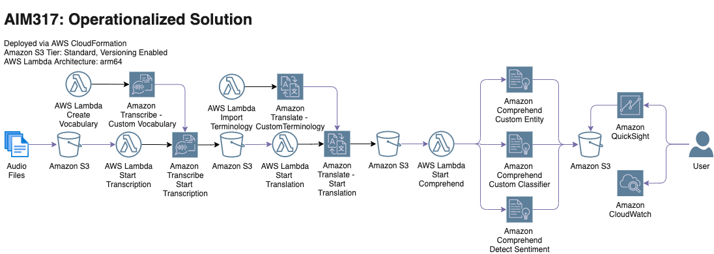
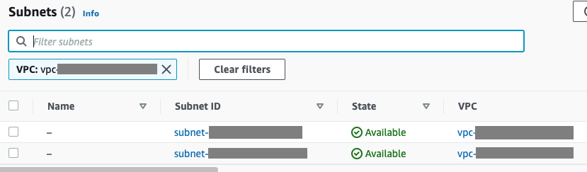

# Amazon Web Services Workshop
## Uncover insights from customer conversations — no ML expertise required

Abstract: 
Understanding what your customers are saying is critical to your business. But navigating the technology needed to make sense of these conversations can be daunting. In this hands-on workshop, you will discover how to uncover valuable insights from your data using custom models that are tailored to your business needs—no ML expertise required. With a set of customer calls, learn how to boost transcription accuracy with Amazon Transcribe custom language models, extract insights with Amazon Comprehend custom entities, localize content with Amazon Translate active custom translation, and create powerful visualizations with Amazon QuickSight.

This workshop is designed to guide AWS re:Invent attendees through setting up a complete end-to-end solution for analyzing voice recordings of customer and support representative interactions  These analyses can be used to detect sentiment, keywords, transcriptions, or translations. 

The following are the high-level steps to deploy this solution:

## Get Started

Use this following AWS CloudFormation quick start to create XXX.

Follow are the list of the parameters. 

| Parameters         | Description                                    |
| ------------------ | ---------------------------------------------- |
| SubnetID           | Subnet where the Lambdas will be deployed      |

You can copy the the required `SubnetID` from your default VPC in the VPC service in the console.

## Security

See [CONTRIBUTING](CONTRIBUTING.md#security-issue-notifications) for more information.

## License

This library is licensed under the MIT-0 License. See the [LICENSE](LICENSE) file.
